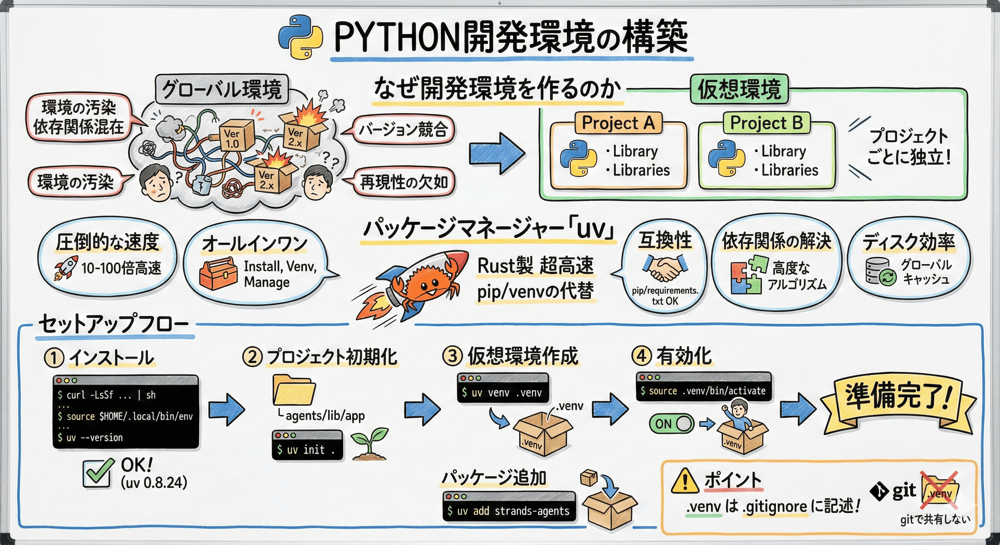

# 1. Python開発環境の構築

##  全体像



## なぜ開発環境を作るのか

Pythonのライブラリをグローバル環境に直接インストールすると、以下の問題が発生する：

- **環境の汚染**: システム全体にライブラリがインストールされ、プロジェクト間で依存関係が混在する
- **バージョン競合**: 異なるプロジェクトで同じライブラリの異なるバージョンが必要な場合に対応できない
- **再現性の欠如**: 他の開発者や本番環境で同じ環境を再現することが困難になる

仮想環境を使うことで、プロジェクトごとに独立した環境を作成し、これらの問題を回避できる

## パッケージマネージャー「uv」

**uv**は、Rust製の超高速なPythonパッケージマネージャー・プロジェクト管理ツール。従来の`pip`や`venv`の代替として開発され、Pythonプロジェクトの依存関係管理を効率化する。

### uvのメリット

1. **圧倒的な速度**: Rustで書かれているため、pipと比較して10-100倍高速
2. **オールインワン**: パッケージのインストール、仮想環境の作成、プロジェクト管理を1つのツールで完結
3. **互換性**: pipやrequirements.txtと互換性があり、既存プロジェクトにも導入しやすい
4. **依存関係の解決**: より高度な依存関係解決アルゴリズムで、競合を効率的に処理
5. **ディスク効率**: グローバルキャッシュによりディスク使用量を削減

## 1.1. python 開発環境のセットアップ

### uv をインストールする

curl でインストーラを取得。

```sh
curl -LsSf https://astral.sh/uv/install.sh | sh
```

シェルを停止・起動し直すか、以下コマンドを実行する事でパスを読めるようになる。

```sh
source $HOME/.local/bin/env
```

インストール確認

```sh
uv --version
# 期待値: uv 0.10.0
```

uv のバージョンが表示されれば成功。

### プロジェクトの初期化

初期プロジェクトを作成する。

```sh
# プロジェクトディレクトリを作成
mkdir agents/lib/app

# プロジェクトディレクトリへ移動
cd agents/lib/app

# 初期プロジェクトを作成
uv init .

# 期待値: Initialized project `app` at `/home/ubuntu/agents/lib/app`
```

### 仮想環境の作成

```sh
uv venv .venv

# 期待値:
# Using CPython 3.12.3 interpreter at: /usr/bin/python3.12
# Creating virtual environment at: .venv
# Activate with: source .venv/bin/activate
```

表示されている通り、以下コマンドを実行する事で仮想環境を有効化出来る。

```sh
source .venv/bin/activate
```

これで Python 開発の準備は完了。

## 1.2. パッケージの追加

```sh
uv add strands-agents
```

## ポイント

- venv 環境は .gitignore に記述し、git で共有しない

---

以上でこのセクションは完了です。
お疲れ様でした!