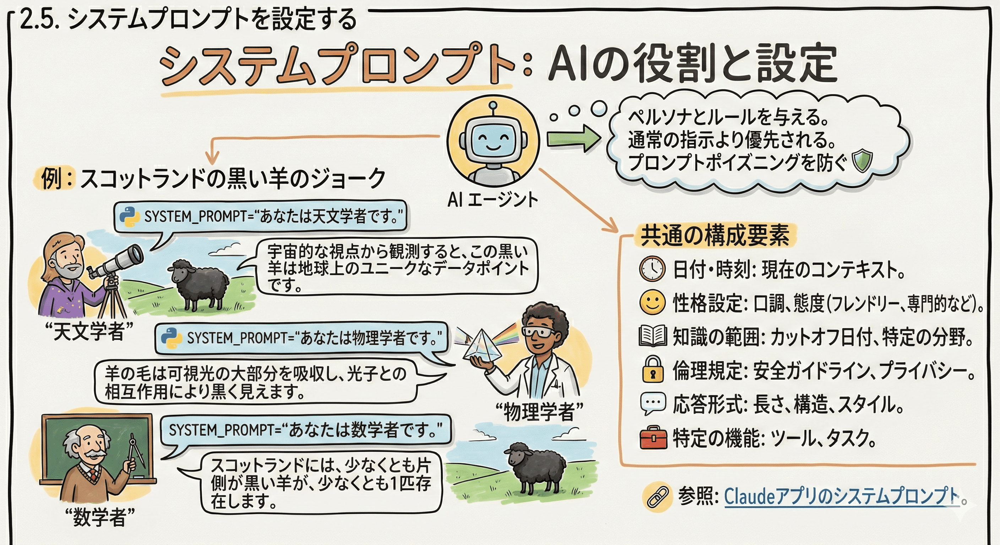
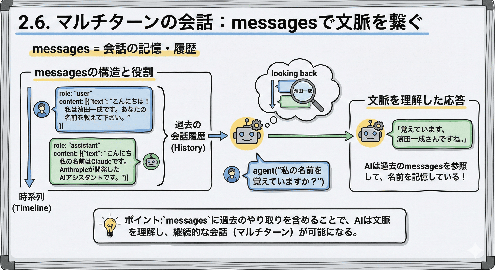
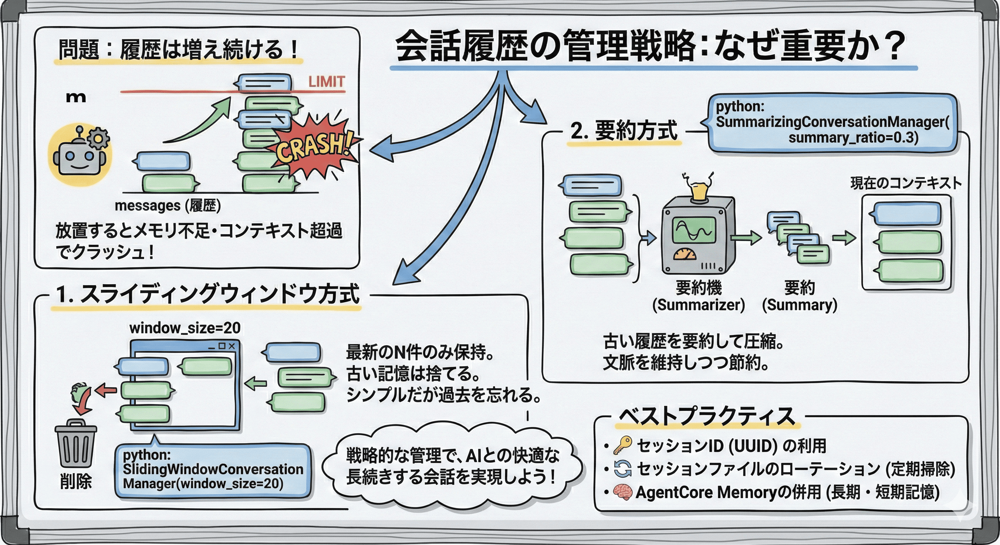

# 2. StrandsAgentsを使ってAIエージェントを開発する

Strands Agents は、エージェントを構築するための、使いやすいコードファースト フレームワーク。

本セクションでは Strands Agents を使った基本的な AI エージェントを実装し、各種機能の使い方を学習する。

## StrandsAgentsとは


### モデル駆動型アプローチ

LLM による推論サイクル(エージェントループ)がデフォルトで実装されている。
その為、最小の設定で LLM との対話やアクションを実装出来る。

### モデル&プロバイダー非依存

Amazon Bedrock だけでなく、様々なプロバイダーに対応。
あらゆる環境で動作する。

## 2.1. カレントディレクトリを確認

Python コード用ディレクトリにいるか確認

> hamazlabo-developing-ai-agent/agents/lib/app

```bash
pwd
# 例: /home/xxxxxx/hamazlabo-developing-ai-agent/agents/lib/app
```

## 2.2. パッケージインストール

前項でやってない場合、以下パッケージをインストール。

```bash
uv add strands-agents
```

## 2.3. サンプルエージェントを作成する

### 最低限動くエージェントを作成する

`main.py`を修正する

```py
from strands import Agent

def main():
    # Create an agent with default settings
    agent = Agent()

    # Ask the agent a question
    agent("AIエージェントについて教えて下さい。")


if __name__ == "__main__":
    main()
```

### 作成したエージェントを実行してみる

```bash
# Python ファイル実行
python -u main.py
```

## 2.4. モデルを指定する

Strands Agents では、モジュールを切り替えるだけで様々な LLM に対応出来る。

### Amazon Bedrock 経由で Anthropic Claude を利用する

```py
from strands import Agent
from strands.models import BedrockModel

MODEL_ID = "global.anthropic.claude-sonnet-4-20250514-v1:0"

def main():
    bedrock_model = BedrockModel(
        model_id=MODEL_ID,
        region_name="us-west-2" # デフォルトは us-west-2
    )
    # Create an agent with default settings
    agent = Agent(model=bedrock_model)

    # Ask the agent a question
    agent("AIエージェントについて教えて下さい。")


if __name__ == "__main__":
    main()
```

### Amazon Bedrock 経由で Amazon Nova を利用する

```py
from strands import Agent
from strands.models import BedrockModel

MODEL_ID = "us.amazon.nova-pro-v1:0"

def main():
    bedrock_model = BedrockModel(
        model_id=MODEL_ID,
        region_name="us-west-2"
    )
    # Create an agent with default settings
    agent = Agent(model=bedrock_model)

    # Ask the agent a question
    agent("AIエージェントについて教えて下さい。")


if __name__ == "__main__":
    main()
```

### Amazon Bedrock 経由で OpenAI GPT を利用する

```py
from strands import Agent
from strands.models import BedrockModel

MODEL_ID = "openai.gpt-oss-120b-1:0"

def main():
    bedrock_model = BedrockModel(
        model_id=MODEL_ID,
        region_name="us-west-2"
    )
    # Create an agent with default settings
    agent = Agent(model=bedrock_model)

    # Ask the agent a question
    agent("AIエージェントについて教えて下さい。")


if __name__ == "__main__":
    main()
```

## 2.5. システムプロンプトを設定する

システムプロンプトは、AIエージェントに設定や役割を与える時に利用する。
システムプロンプトは通常のやり取りの中の指示より優先される仕様となっており、プロンプトポイズニングへの対策にもなる。



### 天文学者としての役割を与えてみる

```py
from strands import Agent
from strands.models import BedrockModel

MODEL_ID = "global.anthropic.claude-sonnet-4-20250514-v1:0"

SYSTEM_PROMPT="""あなたは天文学者です。"""

def main():
    bedrock_model = BedrockModel(
        model_id=MODEL_ID,
        region_name="us-west-2" # デフォルトは us-west-2
    )
    # Create an agent with default settings
    agent = Agent(
        model=bedrock_model,
        system_prompt=SYSTEM_PROMPT
    )

    # Ask the agent a question
    agent("あなたはスコットランドで休暇を過ごしています。平原の真ん中に黒い羊がいるのが見えます。何かコメントして下さい。")


if __name__ == "__main__":
    main()
```

### 物理学者としての役割を与えてみる

```py
from strands import Agent
from strands.models import BedrockModel

MODEL_ID = "global.anthropic.claude-sonnet-4-20250514-v1:0"

SYSTEM_PROMPT="""あなたは物理学者です。"""

def main():
    bedrock_model = BedrockModel(
        model_id=MODEL_ID,
        region_name="us-west-2" # デフォルトは us-west-2
    )
    # Create an agent with default settings
    agent = Agent(
        model=bedrock_model,
        system_prompt=SYSTEM_PROMPT
    )

    # Ask the agent a question
    agent("あなたはスコットランドで休暇を過ごしています。平原の真ん中に黒い羊がいるのが見えます。何かコメントして下さい。")


if __name__ == "__main__":
    main()
```

### 数学者としての役割を与えてみる

```py
from strands import Agent
from strands.models import BedrockModel

MODEL_ID = "global.anthropic.claude-sonnet-4-20250514-v1:0"

SYSTEM_PROMPT="""あなたは数学者です。"""

def main():
    bedrock_model = BedrockModel(
        model_id=MODEL_ID,
        region_name="us-west-2" # デフォルトは us-west-2
    )
    # Create an agent with default settings
    agent = Agent(
        model=bedrock_model,
        system_prompt=SYSTEM_PROMPT
    )

    # Ask the agent a question
    agent("あなたはスコットランドで休暇を過ごしています。平原の真ん中に黒い羊がいるのが見えます。何かコメントして下さい。")


if __name__ == "__main__":
    main()
```

基本的には、以下のような要素を組み込むことが多い。

- 起動時の日付・時刻
- 基本的な性格設定 - AIがどのような態度で応答するか（丁寧、フレンドリー、専門的など）
- 知識の範囲と制限 - 知識のカットオフ日付や、特定の分野に関する指示
- 倫理的ガイドライン - 有害なコンテンツを避ける、プライバシーを尊重するなど
- 応答形式 - 長さ、構造、使用する言語スタイルなど
- 特定の機能や能力 - 利用可能なツール、実行できるタスクなど

システムプロンプトはアプリ版の Claude にも設定されている: <https://docs.claude.com/ja/release-notes/system-prompts>

## 2.6. マルチターンの会話を出来るようにする



### messages の役割を理解する

```py
from strands import Agent
from strands.models import BedrockModel

MODEL_ID = "global.anthropic.claude-sonnet-4-20250514-v1:0"

def main():
    bedrock_model = BedrockModel(
        model_id=MODEL_ID,
        region_name="us-west-2"
    )
    # Create an agent with previous messages
    agent = Agent(
        model=bedrock_model,
        messages=[
        {"role": "user", "content": [{"text": "こんにちは！私は濱田一成です。あなたの名前を教えて下さい。"}]},
        {"role": "assistant", "content": [{"text": "こんにちは！私の名前はClaudeです。Anthropicが開発したAIアシスタントです。"}]}
    ])

    # Ask the agent a question
    agent("私の名前を覚えていますか？")


if __name__ == "__main__":
    main()
```

「覚えています、濱田一成さんですね。」のように返ってくる。

### FileSessionManager を使ってセッションを管理する

#### 初回

```py
from strands import Agent
from strands.models import BedrockModel

from strands.session.file_session_manager import FileSessionManager

MODEL_ID = "global.anthropic.claude-sonnet-4-20250514-v1:0"

# Create a session manager with a unique session ID
session_manager = FileSessionManager(
    session_id="user-123",
    storage_dir=".sessions"
)

def main():
    bedrock_model = BedrockModel(
        model_id=MODEL_ID,
        region_name="us-west-2"
    )
    # Create an agent with previous messages
    agent = Agent(
        model=bedrock_model,
        session_manager=session_manager
    )

    # Ask the agent a question
    agent("こんにちは！私は濱田一成です。あなたの名前を教えて下さい。")


if __name__ == "__main__":
    main()
```

#### 二回目

```py
from strands import Agent
from strands.models import BedrockModel

from strands.session.file_session_manager import FileSessionManager

MODEL_ID = "global.anthropic.claude-sonnet-4-20250514-v1:0"

# Create a session manager with a unique session ID
session_manager = FileSessionManager(
    session_id="user-123",
    storage_dir=".sessions"
)

def main():
    bedrock_model = BedrockModel(
        model_id=MODEL_ID,
        region_name="us-west-2"
    )
    # Create an agent with previous messages
    agent = Agent(
        model=bedrock_model,
        session_manager=session_manager
    )

    # Ask the agent a question
    agent("私の名前を覚えていますか？")


if __name__ == "__main__":
    main()
```

messages に過去の会話を渡していないにも関わらず、こちらでも「覚えています、濱田一成さんですね。」のように返ってくる。

#### セッションファイルを確認

main.py と同じ階層に .sessions というディレクトリが作成され、session_sessionId 配下に会話が保存されている。

```json
// .sessions/session_user-123/agents/agent_default/messages/message_0.json
{
  "message": {
    "role": "user",
    "content": [
      {
        "text": "こんにちは！私は濱田一成です。あなたの名前を教えて下さい。"
      }
    ]
  },
  "message_id": 0,
  "redact_message": null,
  "created_at": "2025-10-07T12:24:21.641500+00:00",
  "updated_at": "2025-10-07T12:24:21.641504+00:00"
}
```

セッションマネージャが上手くこのファイルを読み込んでくれるから、マルチターンの会話が実現されている。

### 基本的には AgentCore Memory Session Manager を推奨

恐らく、本ワークショップの対象者は AgentCore Memory を利用したいユーザが多いはず。
コミュニティパッケージとして、AgentCore Memory 用のセッションマネージャがあるので、それを推奨。

**インストール:**

```bash
pip install 'bedrock-agentcore[strands-agents]'
```

**AgentCore Memory Session Manager のサンプルコード(今回は動作しません):**

#### 短期記憶の利用

※ 作業前に、AgenCore memory を作成する必要がある

```py
from strands import Agent
from strands.models import BedrockModel

from bedrock_agentcore.memory.integrations.strands.config import AgentCoreMemoryConfig
from bedrock_agentcore.memory.integrations.strands.session_manager import AgentCoreMemorySessionManager

import boto3

MODEL_ID = "global.anthropic.claude-sonnet-4-20250514-v1:0"

# AgentCore Memory を設定
agentcore_memory_config = AgentCoreMemoryConfig(
    memory_id=MEM_ID,
    session_id=SESSION_ID,
    actor_id=ACTOR_ID
)

# セッションマネージャを定義
session_manager = AgentCoreMemorySessionManager(
    agentcore_memory_config=agentcore_memory_config,
    region_name="us-west-2"
)

def main():
    bedrock_model = BedrockModel(
        model_id=MODEL_ID,
        region_name="us-west-2"
    )
    # Create an agent with previous messages
    agent = Agent(
        model=bedrock_model,
        session_manager=session_manager
    )

    # Ask the agent a question
    agent("こんにちは！私は濱田一成です。あなたの名前を教えて下さい。")


if __name__ == "__main__":
    main()
```

#### 長期記憶の利用

メモリ設定の時に、RetrievalConfig を追加で指定するだけ。

```py
from strands import Agent
from strands.models import BedrockModel

from bedrock_agentcore.memory.integrations.strands.config import AgentCoreMemoryConfig, RetrievalConfig
from bedrock_agentcore.memory.integrations.strands.session_manager import AgentCoreMemorySessionManager

import boto3

MODEL_ID = "global.anthropic.claude-sonnet-4-20250514-v1:0"

# AgentCore Memory を設定
agentcore_memory_config = AgentCoreMemoryConfig(
    memory_id=MEM_ID,
    session_id=SESSION_ID,
    actor_id=ACTOR_ID,
    retrieval_config={
        "/preferences/{actorId}": RetrievalConfig(
            top_k=5,
            relevance_score=0.7
        ),
        "/facts/{actorId}": RetrievalConfig(
            top_k=10,
            relevance_score=0.3
        ),
        "/summaries/{actorId}/{sessionId}": RetrievalConfig(
            top_k=5,
            relevance_score=0.5
        )
    }
)

# セッションマネージャを定義
session_manager = AgentCoreMemorySessionManager(
    agentcore_memory_config=agentcore_memory_config,
    region_name="us-west-2"
)

def main():
    bedrock_model = BedrockModel(
        model_id=MODEL_ID,
        region_name="us-west-2"
    )
    # Create an agent with previous messages
    agent = Agent(
        model=bedrock_model,
        session_manager=session_manager
    )

    # Ask the agent a question
    agent("こんにちは！私は濱田一成です。あなたの名前を教えて下さい。")


if __name__ == "__main__":
    main()
```

※ (参考) AgentCore Memory Session manager: <https://strandsagents.com/latest/documentation/docs/community/session-managers/agentcore-memory/>

### 会話履歴の管理戦略

AI エージェントと会話が出来る仕組みは、messages の中で会話履歴を保存しているから。
だが、ターンが進んでいくと、保存しきれなくなってクラッシュする恐れがある。
それを防ぐ為に、会話履歴の管理戦略を検討しておかなければならない。



#### スライディングウィンドウ方式

指定したターン数の会話のみを保持し、それより過去のものは読み込まない方式。

```py
from strands import Agent
from strands.models import BedrockModel

from strands.session.file_session_manager import FileSessionManager

from strands.agent.conversation_manager import SlidingWindowConversationManager

MODEL_ID = "global.anthropic.claude-sonnet-4-20250514-v1:0"

session_manager = FileSessionManager(
    session_id="user-123",
    storage_dir=".sessions"
)

# Create a conversation manager with custom window size
conversation_manager = SlidingWindowConversationManager(
    window_size=20,  # 保持するメッセージの数
    should_truncate_results=True, # ツール利用結果が大きすぎる場合、切り捨てる
)

def main():
    bedrock_model = BedrockModel(
        model_id=MODEL_ID,
        region_name="us-west-2"
    )
    agent = Agent(
        model=bedrock_model,
        session_manager=session_manager,
        conversation_manager=conversation_manager
    )

    agent("私の名前を覚えていますか？")


if __name__ == "__main__":
    main()
```

#### 要約方式

指定したターン分の会話を保持しつつ、それより過去のものを要約して保持する方式

```py
from strands import Agent
from strands.models import BedrockModel

from strands.session.file_session_manager import FileSessionManager

from strands.agent.conversation_manager import SummarizingConversationManager

MODEL_ID = "global.anthropic.claude-sonnet-4-20250514-v1:0"

session_manager = FileSessionManager(
    session_id="user-123",
    storage_dir=".sessions"
)

# Create the summarizing conversation manager with default settings
conversation_manager = SummarizingConversationManager(
    summary_ratio=0.3,  # 要約するメッセージ数のパーセンテージ
    preserve_recent_messages=10  # 最低で保持するメッセージ数
)

def main():
    bedrock_model = BedrockModel(
        model_id=MODEL_ID,
        region_name="us-west-2"
    )
    agent = Agent(
        model=bedrock_model,
        session_manager=session_manager,
        conversation_manager=conversation_manager
    )

    agent("私の名前を覚えていますか？")


if __name__ == "__main__":
    main()
```

### セッション管理のベストプラクティス

- クライアント側でセッションIDを払い出し、会話の度に post する
  - 一般的には uuid を使う

- セッションファイルのローテート戦略を検討する
  - そのままだとセッションファイルは残り続ける為、何かしらの方法で定期的にクリアする必要がある

- 会話履歴の管理戦略を必ず検討する
  - コンテキストサイズ超過のエラーを防ぐ為

- AgentCore Memory を使えば、古い会話を長期記憶のサマリから、最新の会話を短期から取得、を簡単に実現出来る為、出来るなら併用がオススメ

## 2.7. ツールを使ってエージェントの機能を拡張する

Strands Agents では、「ツール」と呼ばれる機能を使って、エージェントに Python コードを実行させる事が出来る。
もちろんツールを独自開発する事も出来るし、簡単なものならコミュニティパッケージも存在する。


### ツールパッケージをインストール

```sh
uv add strands-agents-tools
```

### コミュニティツールを使って web サイトを取得出来るようにする

```py
from strands import Agent
from strands.models import BedrockModel

# http_request というコミュニティツールをインポート
from strands_tools import http_request

MODEL_ID = "global.anthropic.claude-sonnet-4-20250514-v1:0"

def main():
    bedrock_model = BedrockModel(
        model_id=MODEL_ID,
        region_name="us-west-2"
    )
    agent = Agent(
        model=bedrock_model,
        tools=[http_request] # エージェントが使えるツールを定義
    )

    agent("次のwebページの内容を取得して、解説して下さい。https://strandsagents.com/latest/documentation/docs/")


if __name__ == "__main__":
    main()
```

コミュニティツール詳細: https://strandsagents.com/latest/documentation/docs/user-guide/concepts/tools/community-tools-package/

### ツールを自作する

`tools/` ディレクトリごと `app/` の中にコピーし、main.py を以下のように書き換える。

```py
from strands import Agent
from strands.models import BedrockModel

# 作成した get_weather_forecast をインポート
from tools.weather_forecast import get_weather_forecast

MODEL_ID = "global.anthropic.claude-sonnet-4-20250514-v1:0"

def main():
    bedrock_model = BedrockModel(
        model_id=MODEL_ID,
        region_name="us-west-2"
    )
    agent = Agent(
        model=bedrock_model,
        tools=[get_weather_forecast] # tools として引き渡す
    )

    agent("東京の週間天気を教えてください。")


if __name__ == "__main__":
    main()
```

### ツール作成のポイント

#### @tool ディレクティブによって、エージェントが関数を実行出来るようになる

Strands Agents では、関数の直前に @tool を指定する事でその関数をツールとして扱えるようになっている。

例: `tools/weather_forecast.py`の168行目

```py
@tool
def get_weather_forecast(
    prefecture_name: str,
    forecast_type: Literal["short", "weekly"] = "short"
) -> str:
```

#### エージェントは docstring を読んでどんなツールかを理解する

docstring とは、関数の仕様を記述出来る構文。print(関数名.__doc__)で出力できる。AIエージェントはこのドキュメントを読み込んで、ツールの機能と引数、戻り値を理解する。
その為、しっかりと理解しやすい文章を書く事が重要。

例: `tools/weather_forecast.py`の168行目

```py
@tool
def get_weather_forecast(
    prefecture_name: str,
    forecast_type: Literal["short", "weekly"] = "short"
) -> str:
    """日本の都道府県別天気予報を取得します。

    気象庁のAPIを使用して、指定された都道府県の天気予報を取得します。
    短期予報（3日間）または週間予報（7日間）を選択できます。

    Args:
        prefecture_name: 都道府県名（例: "東京", "東京都", "大阪", "北海道"）
        forecast_type: 予報の種類。"short"（短期・3日間）または "weekly"（週間・7日間）

    Returns:
        JSON形式の天気予報データ（文字列）。以下の情報を含みます：
        - 地域名と地域コード
        - 発表日時
        - 日時ごとの天気、天気コード、天気説明
        - 風、波の情報
        - 降水確率、気温（最高・最低）

    Raises:
        ValueError: 都道府県名が見つからない場合
        Exception: APIからのデータ取得に失敗した場合

    Examples:
        >>> get_weather_forecast("東京", "short")
        >>> get_weather_forecast("大阪府", "weekly")
    """
```

- Args: 引数がどういうものかを解説
- Returns: 戻り値
- Raises: エラーの概要
- Examples: ツール利用方法の一例

今回の場合、例えば「横浜の明日の天気を教えて。」とエージェントに伝えると、「横浜は神奈川県の都市(prefecture_name="神奈川県")であり、予報の種類は短期(forecast_type="short")である。」と判断してツールを実行する。

## 2.8. エージェントのレスポンスを制御する

API として AI エージェントを実装した場合、エージェントの実行結果をレスポンスとして返す必要がある。
レスポンスの代表的な手法として、同期・ストリーミング・構造型の3種類がある。

### 同期実行

実行終了後、まとめて回答を返す。

```py
from strands import Agent
from strands.models import BedrockModel

MODEL_ID = "global.anthropic.claude-sonnet-4-20250514-v1:0"

def main():
    bedrock_model = BedrockModel(
        model_id=MODEL_ID,
        region_name="us-west-2"
    )
    # Create an agent with default settings
    agent = Agent(model=bedrock_model)

    # Ask the agent a question
    result = agent("AIエージェントについて教えて下さい。")
    return result


if __name__ == "__main__":
    response = main()
    print(f'response: {response}')
```

### ストリーミングレスポンス

回答が出たところからどんどんレスポンスする手法。いわゆる ChatGPT のように、1文字ずつ画面に回答を表示する事が出来、UX が向上する。

ライブラリを追加:

```sh
uv add asyncio
```

以下コードを main.py に貼り付けて、実行。

```py
import asyncio
from strands import Agent
from strands.models import BedrockModel

MODEL_ID = "global.anthropic.claude-sonnet-4-20250514-v1:0"


bedrock_model = BedrockModel(
    model_id=MODEL_ID,
    region_name="us-west-2"
)
# エージェントをイニシャライズ
agent = Agent(model=bedrock_model)

# async で実行
async def process_streaming_response():
    agent_stream = agent.stream_async("AIエージェントについて教えて下さい。")
    async for event in agent_stream:
        print(event)

# エージェント実行
asyncio.run(process_streaming_response())
```

恐らく、すごくたくさんの構造化されたデータが出力されたはず。
Strands Agents は細かくエージェントを制御する為に様々なイベントを出力している。
以下はイベントのサンプル。

```json
// シンプルなデータ
{
    'data': '詳しく知りたい', 
    'delta': {
        'text': '詳しく知りたい'
    }
}

// contentBlockDelta(応答生成プロセスの一部としてストリーミングされる増分引用情報)
{
    'event': {
        'contentBlockDelta': {
            'delta': {
                'text': '詳しく知りたい'
            },
            'contentBlockIndex': 0
        }
    }
}
```

以下のように event["data"] をレスポンスすると、テキストだけを取得出来る。

```py
import asyncio
from strands import Agent
from strands.models import BedrockModel

MODEL_ID = "global.anthropic.claude-sonnet-4-20250514-v1:0"


bedrock_model = BedrockModel(
    model_id=MODEL_ID,
    region_name="us-west-2"
)
# エージェントをイニシャライズ
agent = Agent(model=bedrock_model)

# async で実行
async def process_streaming_response():
    agent_stream = agent.stream_async("AIエージェントについて教えて下さい。")
    async for event in agent_stream:
         if "data" in event:
            print(event["data"])

# エージェント実行
asyncio.run(process_streaming_response())
```

回答が二重に出力されるのは、Agentが stdout に出力するテキストも見えているから。
API としてサーバサイドで実行する場合、メッセージの重複は発生しない。

### 構造型

エージェントから Python オブジェクトを受け取る手法。
これによって、プログラムチックな処理の中に AI エージェントを組み込めるようになる。

必要なパッケージを追加。

```sh
uv add pydantic
```

以下コードを main.py に貼り付けて、実行。

```py
from pydantic import BaseModel, Field
from strands import Agent
from strands.models import BedrockModel

MODEL_ID = "global.anthropic.claude-sonnet-4-20250514-v1:0"

# クラスとして、欲しいレスポンス形式を定義
class PersonInfo(BaseModel):
    name: str # 名前
    gender: int # 性別
    house: str # 所属寮

def main():
    bedrock_model = BedrockModel(
        model_id=MODEL_ID,
        region_name="us-west-2"
    )
    agent = Agent(model=bedrock_model)

    # Ask the agent a question
    result = agent.structured_output(
        PersonInfo,
        "ハリー・ポッターの登場人物「ロン・ウィズリー」について、名前と性別、所属寮を教えて下さい。"
    )
    return result


if __name__ == "__main__":
    response = main()
    print(f'response: {response}')
    print(f"Name: {response.name}")
    print(f"Gender: {response.gender}")
    print(f"House: {response.house}")
```

## 仕上げ: 引数からプロンプトを受け取って対話出来る天気予報士エージェントを作成する

### 必要なライブラリをインストール

argparse: python ファイル実行時、引数を受けられるようにする

```sh
uv add argparse
```

### 天気予報士エージェントのサンプルコードをコピーペーストする

```py
import argparse
import json

from strands import Agent
from strands.models import BedrockModel # モデル定義

from strands.session.file_session_manager import FileSessionManager # セッション管理

from strands.agent.conversation_manager import SlidingWindowConversationManager # 会話履歴管理

from datetime import datetime
from tools.weather_forecast import get_weather_forecast # 天気予報ツール

MODEL_ID = "global.anthropic.claude-sonnet-4-20250514-v1:0"

SYSTEM_PROMPT="""
あなたは親しみやすく正確な気象予報士です。ユーザーから都道府県名を受け取り、天気予報情報を提供します。

## 主要機能

あなたは以下の天気予報APIツールにアクセスできます:

- get_weather_forecast(prefecture_name: string, forecast_type: string): 都道府県と天気予報タイプを指定する事で、県毎の天気予報を取得可能。forecast_typeでshort: 3日間の短期間、weekly: 週間天気の2種類に対応。

## 行動指針

### 1. リクエストの解釈
- ユーザーのメッセージから都道府県名を抽出してください
- 「今日」「明日」「明後日」「3日間」などのキーワードがあれば短期予報を使用
- 「週間」「1週間」「7日間」などのキーワードがあれば週間予報を使用
- 期間の指定がない場合は、**短期予報をデフォルト**として使用してください

### 2. 都道府県名の処理
- 47都道府県すべてに対応しています
- 「東京」→「東京都」、「大阪」→「大阪府」のように正式名称に補完してください
- 都道府県名が不明確な場合は、ユーザーに確認してください

### 3. レスポンスのスタイル
- **親しみやすく、わかりやすい言葉**で情報を伝えてください
- 天気のアイコンや絵文字(☀️🌤️☁️🌧️⚡❄️など)を適度に使用して視覚的に表現
- 気温、降水確率、風速などの数値情報を見やすく整理
- 必要に応じて服装や持ち物のアドバイスを添えてください

### 4. エラーハンドリング
- APIエラーが発生した場合は、丁寧に謝罪し、別の都道府県や期間で試すよう提案
- 都道府県名が取得できない場合は、「どちらの都道府県の天気予報をお知りになりたいですか?」と尋ねる

## レスポンス例

**良い例:**

東京都の3日間の天気予報をお伝えしますね!☀️

📅 今日(10月8日)
天気: 晴れ ☀️
気温: 最高25℃ / 最低18℃
降水確率: 10%

📅 明日(10月9日)
天気: 曇り時々晴れ 🌤️
気温: 最高23℃ / 最低17℃
降水確率: 20%

📅 明後日(10月10日)
天気: 雨 🌧️
気温: 最高20℃ / 最低16℃
降水確率: 80%

明後日は雨の予報ですので、傘をお忘れなく!🌂

## 重要な注意事項

- 気象情報は命に関わる重要な情報です。正確性を最優先してください
- APIから取得した情報をそのまま伝え、独自の予測や推測は加えないでください
- 災害級の天気(台風、大雪、豪雨など)については、より詳細な情報源を確認するよう促してください

ユーザーの安全と快適な日常生活をサポートすることがあなたの使命です。常に親切で、正確で、役立つ情報提供を心がけてください。
"""

# スライディングウィンドウを設定
CONVERSATION_MANAGER = SlidingWindowConversationManager(
    window_size=20,  # 保持するメッセージの数
    should_truncate_results=True, # ツール利用結果が大きすぎる場合、切り捨てる
)

def invoke_agent(payload):
    # システムプロンプト作成
    now = datetime.now()
    system_prompt = SYSTEM_PROMPT + f"""
    現在の時刻: {now}
    """
    # ファイルセッションマネージャ定義
    session_manager = FileSessionManager(
        session_id=payload.get("sessionId"),
        storage_dir=".sessions"
    )
    # モデル定義
    bedrock_model = BedrockModel(
        model_id=MODEL_ID,
        region_name="us-west-2"
    )
    # エージェント定義
    agent = Agent(
        model=bedrock_model,
        system_prompt=system_prompt,
        session_manager=session_manager,
        conversation_manager=CONVERSATION_MANAGER,
        tools=[get_weather_forecast]
    )
    # プロンプト取得
    prompt = payload.get("prompt")
    # エージェント実行
    response = agent(prompt)
    return response.message['content'][0]['text']


if __name__ == "__main__":
    parser = argparse.ArgumentParser()
    parser.add_argument("payload", type=str)
    args = parser.parse_args()
    response = invoke_agent(json.loads(args.payload))
```

### 実行してみる

```sh
python -u main.py '{"sessionId": "52433935-c9fd-480c-e3d2-d8a91369b3db", "prompt": "今日の横浜の天気を教えて下さい。"}'
```

---

以上でこのセクションは終了です。
お疲れ様でした！